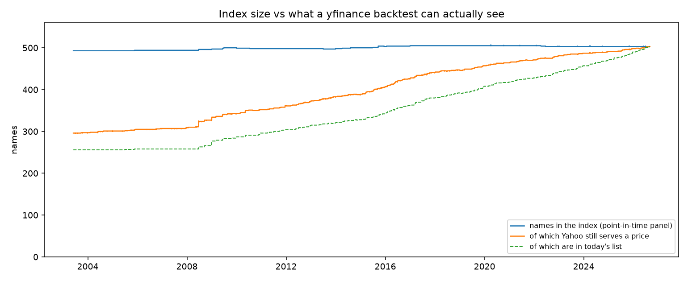
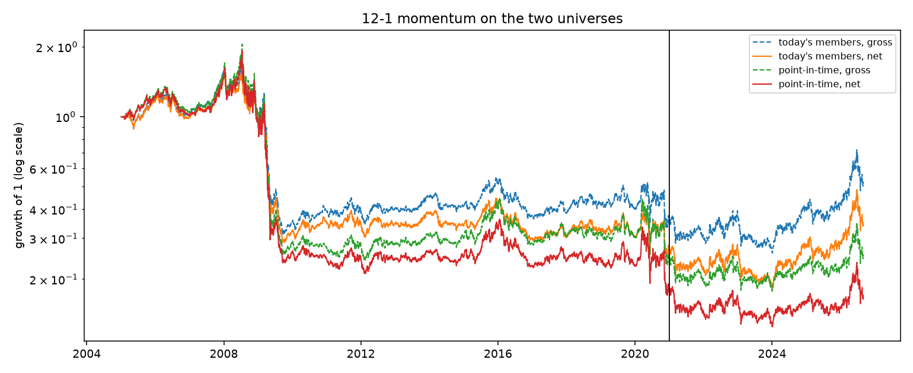

# A point-in-time S&P 500 universe, and what it does to the other backtests

Every equity backtest in this repo pulled "the S&P 500" from a list of today's
members and applied it backwards. Each README flagged that as the largest
unquantified bias in the result. This project builds the membership history
from public sources and reruns two of those strategies, momentum and pairs,
on both universes with the same code, dates and costs, so the bias has a
number instead of a caveat.

Two results. For 12-1 momentum, the today's-members universe overstates gross
annual return by **+2.2%/yr in-sample, +6.3%/yr in the final test, +3.2%/yr
over the full 21 years**. For the pairs screen, the bias runs the other way and
is small: today's members understate out-of-sample net return by 0.7%/yr and
net Sharpe by 0.07, which is inside the noise. The level of the bias on an
equal-weight basket is +4.0%/yr, right where the literature puts it, and it
splits roughly 80/20 between holding future winners before they joined and
dropping the names that were deleted.

## Sources

Wikipedia, twice.

- **Change list.** The "Historical components of the S&P 500" article has a
  table of dated additions and removals. 408 rows after cleaning, but it is
  called "selected changes" for a reason: it records about 20 changes a year
  from 2011 on and almost nothing before 2007, against a true turnover of
  20 to 30 a year.
- **List snapshots.** Old revisions of "List of S&P 500 companies" carry the
  full member table as it stood on the revision date, with tickers from
  2007-11-29 onward. I pull the last revision before January 1 and July 1 of
  every year through the MediaWiki API, 38 snapshots plus today's page.

`data.py` walks forward from each snapshot applying the change rows, and snaps
to the next snapshot when it arrives. Where the walk and the snapshot
disagree, the change table missed something; the panel takes the snapshot and
logs the correction (169 of them, 154 in 2008-2010 where the table is thin).
Where a change row sits within 45 days of a snapshot, the disagreement is a
Wikipedia editing lag and the change row wins. Before the first snapshot the
walk runs backward, which for 2003-2007 means "late-2007 membership minus the
handful of changes the table knows", and that period should be read that way.

Symbols are reconciled to the ticker yfinance serves the history under. 54
renames by hand (FB to META, UTX to RTX, CBS to VIAC to PARA to PSKY) and 17
matched automatically because the security name reappeared under a new symbol
(HCN to WELL, BK to BNY). Renames are dated, so a symbol that was later reused
by a different company (MNST was Monster Worldwide before it was Monster
Beverage, IR was Ingersoll-Rand before it was Gardner Denver) maps only for
mentions before the reuse. What could not be explained is written to
`reports/unresolved.csv`, 154 rows, almost all of them real changes the table
lacks.

## The panel

893 distinct names over 5,850 trading days, 2003-06-02 to 2026-08-31. Per day
it holds 493 to 507 names, which is the right size: the index has carried 500
to 505 lines since 2015 and my pre-2008 count is 493 because the back-cast
cannot add names the table never recorded.

| Year | Names in index | Priced on Yahoo | Additions | Removals | Change rows | Corrections |
|---|---|---|---|---|---|---|
| 2005 | 493 | 301 (61%) | 2 | 1 | 2 | 0 |
| 2008 | 496 | 324 (64%) | 53 | 50 | 8 | 87 |
| 2010 | 499 | 350 (70%) | 19 | 20 | 11 | 18 |
| 2015 | 501 | 396 (79%) | 29 | 26 | 29 | 3 |
| 2020 | 505 | 462 (91%) | 16 | 16 | 20 | 0 |
| 2025 | 503 | 492 (98%) | 19 | 19 | 21 | 0 |

Full table in `reports/panel_by_year.csv`. The "Additions" column is what the
panel actually applies, change rows plus corrections; in 2008 the table knew
8 changes and the snapshots revealed 87 more.

### What Yahoo still serves

This is the part that cannot be fixed with a better membership table. 390
names were in the index at some point and are not in it now. **133 of them
(34%) have any price history on Yahoo, 121 (31%) have prices on at least 90%
of their member days, and 257 have nothing.** Recovery is under 20% for names
removed before 2010 and around half for names removed since 2020.



The gap between the blue and orange lines is the delisting bias. It is 40% of
the index in 2005 and still 10% in 2020. The names that are missing are not a
random sample: Yahoo drops acquired and bankrupt companies and keeps the ones
that were merely demoted to the mid-cap index, so what I recover is the mild
end of the removal distribution. Every point-in-time number below is therefore
a lower bound on the bias, and the residual is named, not hidden.

Yahoo is also already eating today's list. AVB and EA left the index in August
2026 and their histories are down to a few weeks each. 14 current members (DOW,
GM, KMI, HLT, DELL and others that re-listed after an earlier exit, plus spin-offs
like CEG and SNDK) have prices on fewer than 90% of their member days.

## Level of the bias

Equal-weight daily-rebalanced basket of every name with a price, membership
decided the day before, no costs, no liquidity filter.

| Universe | In-sample 2005-2020 | Final test 2021-2026 | Full |
|---|---|---|---|
| Today's members, full history (what the repo did) | +16.61% | +16.95% | +16.70% |
| Today's members, only while members | +13.38% | +14.44% | +13.66% |
| Point-in-time members | +12.64% | +12.72% | +12.66% |
| SPY | +9.49% | +15.09% | +10.92% |

The top-to-bottom gap is **+3.97%/yr in-sample and +4.23%/yr out of sample.**
The published range for survivorship bias in equity backtests is 1 to 4%/yr,
and a large-cap universe with 21 years of compounding sits at the top of it.

The split matters more than the total. Rows one and two differ by 3.2%/yr,
and that is not survivorship in the textbook sense at all: it is holding NVDA,
TSLA, META, AVGO and every other name that joined the index after winning, for
the years before it joined. Rows two and three differ by 0.74%/yr, which is
the deleted-losers effect, and it is understated because two-thirds of the
deleted losers have no prices to contribute.

## Momentum

`survivorship.py` imports `momentum.py`, `backtest.py` and `data.eligibility`
from the momentum project and runs the frozen baseline (252/21 lookback,
decile tails, monthly rebalance, one-day lag, 10bps one-way, 50bps/yr borrow)
on two masks: today's 503 names applied back to 2003, and the point-in-time
panel. Everything else is identical, including the rebalance dates, which are
built from the same price index.

| In-sample 2005-2020 | Today's members | Point-in-time | Bias (a - b) |
|---|---|---|---|
| Gross annual return | -6.25% | -8.42% | **+2.17%** |
| Net annual return | -7.98% | -10.11% | +2.13% |
| Gross Sharpe | -0.14 | -0.17 | +0.03 |
| Net Sharpe | -0.22 | -0.24 | +0.02 |
| Max drawdown, net | -84.8% | -91.2% | +6.4 pts |
| Long leg | +18.34% | +9.90% | +8.44% |
| Short leg | -24.69% | -20.85% | -3.84% |
| Eligible names, median | 401 | 367 | |
| Share of short book outside today's list | 0% | 32.3% | |

| Final test 2021-2026 | Today's members | Point-in-time | Bias (a - b) |
|---|---|---|---|
| Gross annual return | +6.39% | +0.03% | **+6.35%** |
| Net annual return | +4.50% | -1.80% | +6.29% |
| Gross Sharpe | 0.36 | 0.13 | +0.23 |
| Net Sharpe | 0.30 | 0.06 | +0.23 |
| Max drawdown, net | -35.7% | -33.6% | -2.2 pts |
| Long leg | +30.98% | +18.53% | +12.44% |
| Short leg | -20.84% | -17.45% | -3.39% |

Full sample: gross +3.18%/yr, net +3.14%/yr, gross Sharpe +0.10. Tables in
`reports/momentum_*.csv`.



Three things in these tables I did not expect.

**The bias is positive and it comes from the long leg.** The momentum README
argued the sign was ambiguous because the short leg is starved of the losers
that were deleted. That half is real, and it shows up here: the short leg is
3.4 to 3.8%/yr *better* on the point-in-time universe, and a third of the
point-in-time short book sits in names that are no longer in the index. But
the long leg swings 8 to 12%/yr the other way and wins. A long leg built from
today's members is buying the top decile of a list that was assembled by
looking at who won, and in 2021-2026 that decile was full of names that did
not qualify for the index until they had already run.

**It does not rescue the strategy.** Point-in-time 12-1 momentum on the full
index is worse than the survivor version, not better: -8.4%/yr gross
in-sample, -91% drawdown, Sharpe indistinguishable from zero in every window.
The universe was flattering the result, and a fair universe makes the null
result more null. The one caveat is that the fair universe is still missing the
257 deleted names Yahoo does not serve, which are exactly the ones the short
leg wants, so the true point-in-time short leg is probably better than this.

**The bias is largest where the sample is shortest.** +2%/yr over 16 years
becomes +6%/yr over the last five and a half, because the final-test window is
where the most recent index additions had their run-up, and every one of those
run-ups is in the today's-members universe and none in the point-in-time one.

These numbers are on the full index, not the 190-name slice the momentum
project used, so they do not reproduce that README's -3.86%/yr directly. The
slice is a subset of today's members and carries the same bias.

## Pairs

Same idea, importing `pairs.py`, `backtest.py` and `data.clean` from the pairs
project: Engle-Granger on every within-sector pair over the 2015-2019
formation window, p <= 0.05, at most 40 pairs with no name reused, then traded
out of sample 2020-2026 with the rules that project chose (90-day z-score,
enter at 1.5, exit at 0, stop at 4, 60-day max hold, 10bps round trip).

The today's-members universe is exactly what the pairs project did: names must
have 99% complete prices over the *whole* sample, formation and out-of-sample.
That rule silently requires every name to survive to 2026. The point-in-time
universe takes the index as it stood on 2019-12-31, requires completeness over
formation only, and lets a name's series end when Yahoo's does. Sector labels
for it come from the 2019-12-31 list snapshot.

| Out-of-sample 2020-2026 | Today's members | Point-in-time | Bias (a - b) |
|---|---|---|---|
| Names screened | 459 | 446 | |
| Pairs tested | 11,508 | 10,511 | |
| Gross annual return | +1.17% | +1.84% | -0.67% |
| Net annual return | +0.69% | +1.35% | -0.66% |
| Gross Sharpe | 0.33 | 0.36 | -0.03 |
| Net Sharpe | 0.20 | 0.27 | -0.07 |
| Max drawdown, net | -8.0% | -13.4% | +5.3 pts |
| Trades | 1,296 | 1,307 | |
| Hit rate | 62.7% | 62.7% | |

Formation-window numbers and the two selected-pair lists are in `reports/`.
23 of the 40 pairs are chosen on both universes. Seven names in the
point-in-time selection have since left the index (BBWI, HOG, NWL, PRGO, UAA,
VFC, ZION).

So for pairs the survivor universe makes the strategy look slightly *worse*,
and the drawdown row shows why the two effects offset. The point-in-time
drawdown is March 2020, and the pairs that lost most in it were MGM/UAA,
NWL/VFC and BBWI/LOW: four of those six names have since been dropped from the
index, so the today's-members screen could never have selected them and never
took the hit. Those same names then mean-reverted hard through 2020-2021 and
the point-in-time book earned it back and more. A survivor filter removes the
names that fell apart, which for a mean-reversion trade removes both the
blow-ups and the recoveries. The net effect here is a 0.07 difference in
Sharpe over 6.7 years, where the standard error on a Sharpe is about 0.4. It is
not distinguishable from zero, and I report it as small rather than as
negative.

The comparison for pairs is also less clean than for momentum, because the
today's-members rule is doing two things at once: restricting to the current
list and requiring full-sample completeness. The point-in-time run relaxes
both. The full-index pairs result (Sharpe 0.2 to 0.3 out of sample) is also
a different number from the 190-name slice in the pairs README (0.08), which
is a universe-size effect, not a survivorship one.

## Checks

`check.py`, 25 checks, exits non-zero on any failure.

- A hand-built change list walks into the right daily membership: a name added
  on d is absent on d-1 and present on d, a removed name is present on d-1 and
  absent on d, an untouched name is in all year, the count moves by the net of
  each change, and a backward walk from the last day reproduces the forward
  panel exactly.
- An anchor the change list disagrees with snaps the panel and logs the
  correction; an anchor that merely lags a change row by less than 45 days does
  not undo it.
- A name that joins on d earns nothing on d and its own return on d+1, and the
  gap filler bridges a hole inside a series without inventing prices after the
  last print.
- Dated renames map a mention before the rename and leave a reused symbol
  alone; chains stop at the symbol in force on the date.
- Symbol reconciliation pairs a vanished ticker with a reappeared security name
  and does not report a change the table already explains.
- On 240 synthetic names with fixed drifts, a "winners survive" filter (keep the
  top 60% by realised return) makes the survivor basket beat the full basket by
  13.1%/yr; a filter on the *true* drift plants a gap that can be written down
  in advance (+10.93%/yr) and the harness measures +10.74%/yr; a random filter
  of the same size shows -1.0%/yr, inside noise. The momentum harness on the
  same data shows the difference column is a minus b, the survivor book never
  holds a non-survivor, and dropping the losers makes the short leg worse by
  17.5%/yr, which is the sign the real data shows too.

## How to run

```
python3 check.py     # offline, ~5 seconds
python3 run.py       # ~4 minutes, mostly the 22,000 cointegration tests
python3 data.py      # just rebuild the panel and report coverage
```

First run fetches 40 Wikipedia pages and about 900 price histories, cached to
`../source-material/pit-universe/`. Reruns are offline.

## Limitations

**Two-thirds of the deleted names have no prices, and they are the bad
two-thirds.** 257 of 390 removed names return nothing from Yahoo, and the ones
that do are mostly demotions to the S&P 400, not bankruptcies or takeouts.
The point-in-time universe is 60% of the true index in 2005 and 90% in 2020.
Every bias number here is a lower bound. Closing this gap needs CRSP or a
paid vendor with delisting returns; no public source I found has them.

**Delisting returns are zero.** When a name's series ends mid-position, the
momentum engine scores its remaining days at zero and the pairs engine flattens
the pair at the last print. For an acquisition that is roughly right, because
Yahoo's last price is near the deal price. For a bankruptcy it is not, and the
bankruptcies are in the 257 anyway.

**2003 to November 2007 is a back-cast, not a record.** The change table has
seven usable rows for those years and the first ticker-bearing snapshot is
2007-11-29.
The panel for that period is late-2007 membership with about 100 unknown
changes missing, which is why the count sits at 493 instead of 500. The
momentum in-sample window starts in 2005, so its first three years run on a
universe that is closer to today's-members than the label suggests.

**Snapshot timing error of up to six months.** 169 changes were recovered only
because a snapshot showed them, and a change recovered that way enters or
leaves on the snapshot date rather than the true effective date. 154 of those
are in 2008-2010, so the crisis years carry a timing error the later years
do not.

**Symbol merging has known holes.** When an acquirer took the acquired
company's ticker (Waste Management inherited WM from Washington Mutual, Actavis
inherited AGN from Allergan), the removal row for the old company briefly
removes the new one too, until the next snapshot restores it. I found two
such cases and did not special-case them. The 54 hand renames are my reading
of corporate history and any one of them could be wrong; `reports/renames.csv`
lists all 71 with their effective dates.

**Sector labels are frozen at one date for the pairs screen.** The
point-in-time pairs universe uses the GICS sector each name had on 2019-12-31,
the today's-members universe uses the sector it has now. GICS reshuffled
several sectors in 2018 and 2023, so a few pairs are "within sector" under one
labelling and not the other.

**yfinance prices are split- and dividend-adjusted today, and that is all.**
The same limitation as the momentum project: no unadjusted prices, no
delisting flags, no corporate-action detail. A name that Yahoo has backfilled
under a successor ticker (VTRS carries Mylan's history, LIN carries Praxair's)
counts as recovered, and I have not audited whether every such backfill is the
right company.
